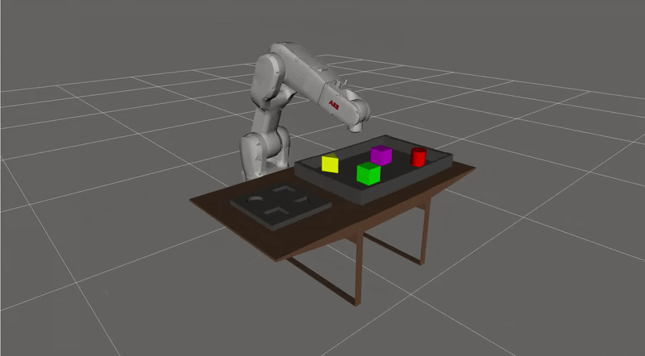
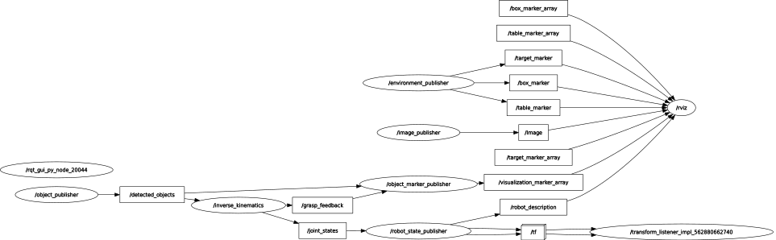
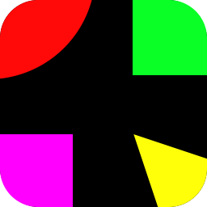

<a href="https://cr.rwth-aachen.de/">
    
</a>

# **Prototyping Project - Documentation**
[](https://forthebadge.com)
&nbsp;&nbsp;&nbsp;&nbsp;
[](https://forthebadge.com)
### Timur Kuzu, Dominik Leitner, Orhun Oezcan 
### **Bin Picking Project** &nbsp; :robot:
**Object Detection based Pick and Place Task**




*The following Readme is an introduction into the Prototyping Project and gives an how-to on installing, building, starting and using the package.*
<br>

## **Table of contents**
* [Overview - Introduction](#overview-introduction)
* [Prerequisites](#prerequisites)
* [How to download, build and run the package](#how-to-download-build-and-run-the-package)
* [Overview data transfer and Communication](#overview-data-transfer-and-communication)
* [Project Status](#project-status)
* [Contact information](#contact-information)

## **Overview - Introduction**  
The goal of this project is to visualize a bin picking task (pick and place) with a 6-DoF robotic arm using ROS2 Humble. The efforts are based upon a real-life prototype/application developed as a collaboration between Liebherr and Fanuc which was presented at the BAUMA 2022. Using a camera system, the robot is able to identify and locate specific objects inside a bin, pick the item and place it inside a designated target location. This technology has the potential to increase efficiency and productivity in the construction industry by automating tasks which are currently performed manually, e.g.: placing bricks from a conveyor belt onto a Euro-pallet to help with packaging in the factory.
The project was adjusted to the requirements of the Prototyping Project and involved the development and implementation of the necessary software components, including the model of the robotic arm as well as object detection and robot movement algorithms. 

## **Prerequisites**  
In order to successfully run the package the following software is recommended:
<br>

:bulb:**ATTENTION**
<br>
If your system currently is operating with Windows, it is highly recommmended to set up a "Dual Boot" ( second OS partition) on your system in order to run Windows and Linux on the same computer. Depending on your current operating system a different process may be required. The following link is an example:
<br>
[Create a Dual Boot on your PC](https://www.youtube.com/watch?v=QKn5U2esuRk&ab_channel=KskRoyal)

**Operating system**
<br>
Ubuntu 22.04.1 LTS (Jammy Jellyfish) - recommended version
<br>
[Ubuntu 22.04 Desktop Image](https://releases.ubuntu.com/22.04/)

**Python 3.10** (or newer)  
```
sudo apt install python3
```

**ROS 2 Humble** 
<br>
The Robot Operating System (ROS) is a framework including software libraries and tools for building robot applications.

:bulb:**ATTENTION**
<br>
Make sure to install the **desktop** version, with the following command:
```
sudo apt install ros-humble-desktop
```
Follow along the installation steps:
<br>
[ROS2 Installation Process](https://docs.ros.org/en/humble/Installation/Ubuntu-Install-Debians.html)
<br>
To check if the installation process was successful double-check by doing the  [tutorials](https://docs.ros.org/en/humble/Tutorials.html).
<br>

:bulb:**ATTENTION**
<br>
Additionally, for this tutorial it is recommended to automatically source the setup file every time you open a new terminal. You can do this by adding it to the shell startup script:
```
echo "source /opt/ros/humble/setup.bash" >> ~/.bashrc
```
## **How to download, build and run the package** 
### **Clone the repository:**
After the ROS2 installation process, make sure to install git:
<br>
```
sudo apt install git 
```
It may be required to configure your git settings first. After that you can clone the repo into your desired directory:
<br>
```
git clone https://git.rwth-aachen.de/prototypingproject20222023/groupg.git
```
When the download is complete, copy the "bin_picking_project" package into the /src directory of your ROS2 workspace.

### **Directory structure - bin_picking_project**
After the installation process the following conditions should be given:
<br>
**ROS2 workspace / package structure:**
```
<user>:~/ros2_ws/src/bin_picking_project 
```
**Package folder structure:**
<details><summary> Click to show / hide folder structure</summary><br/>
<summary>

```
bin_picking_project
│   
├── bin_picking_project
│      │
│      ├── image_processing
│      │	 ├── __init__.py
│      │	 ├── colorlabeler.py
│      │	 └── shapedetector.py
│      │
│      ├── __init__.py
│      ├── environment_marker.py
│      ├── image_publisher.py
│      ├── inverse_kinematics.py
│      ├── object_detection.py
│      └── object_marker.py	
│
├── config
│      ├── params1.yaml 
│      ├── params2.yaml 
│      ├── params3.yaml 
│      └── params4.yaml 
│
├── environment  
│      ├── env_box.dae
│      ├── env_table.dae
│      ├── target_position.dae
│      └── triangle.dae
│
├── launch
│      ├── launch1.py
│      ├── launch2.py
│      ├── launch3.py
│      └── launch4.py
│
├── resource
│      └── bin_picking_project
│
├── start_scripts
│      ├── icons
│      │	 ├── V3_BUILD_ICON.svg
│      │	 └── V3_START_ICON.svg
│      │
│      ├── build_package.sh
│      ├── start_set_1.sh
│      ├── start_set_2.sh
│      ├── start_set_3.sh
│      └── start_set_4.sh
│
├── rviz
│      └── config.rviz
│
├── table_images
│      ├── set_01.jpg
│      ├── set_02.jpg
│      ├── set_03.jpg
│      └── set_04.jpg
│
├── test  
│      ├── test_copyright.py
│      ├── test_flake8.py
│      └── test_pep257.py
│
├── urdf_model
│      ├── meshes
│      │	 ├── base.dae
│      │	 ├── body1.dae
│      │	 ├── body2.dae
│      │	 ├── body3.dae
│      │	 ├── body4.dae
│      │	 ├── body5.dae
│      │	 ├── body6.dae
│      │	 └── __init__.py
│      │
│      └── robot_model.urdf
│
├── package.xml
├── setup.cfg
└── setup.py
```
</details>

### **Build and run the package:**
You can either build the package manually or, **if your workspace is located in the home directory and has the same name and structure as shown above**, use the provided bash script to build the package.

**Run manually:**
<br>
To build manually, inside the workspace (/ros2_ws) use: 
```
colcon build --packages-select bin_picking_project
```
Then, source the environment:
```
. install/setup.bash
```
And finally launch the package (launch1.py - launch4.py available):
```
ros2 launch bin_picking_project launch1.py
```
**Executable files:**
<br>
In order to build and run the project automatically, bash scripts (.sh) were created. They are located in the "start_scripts" folder of the package, but will only be usable if your directory structure is the same as shown above:
```
<user>:~/ros2_ws/src/bin_picking_project/start_scripts
```
After rigth-clicking and running them as a program, the package is either build or launched automatically. The "build_package.sh" script is used to build the package, the "start_set_X.sh" scripts to launch the package with the selected image set.

### **Change environment sets:**
To demonstrate the functionality of the project, different image sets were created with differently located and colored objects. In total, 4 image sets are provided in the "table_images" folder of the package.
```
<user>:~/ros2_ws/src/bin_picking_project/table_images
``` 
To define which image set is used when launching the project, the "paramsX.yaml" files inside the "config" folder change the number of the image file inside the "img_file" variable. **Both** file names, for the "object_publisher" as well as the "image_publisher" node need to be changed! 

## Overview data transfer and Communication
The following graph shows the project’s data transfer and communication accomplished with publishers and subscribers. The object identification from the selected image set is done inside the ”object_publisher” node and serves as the main input for the other nodes. It publishes the object shapes, colors and their x and y coordinates to the /detected_objects topic. This topic is subscribed to by the ”object_marker_publisher” and ”inverse_kinematics” node. The ”object_marker_publisher” creates Marker() objects from this information and publishes the markers as a MarkerArray() message to the /visualization_marker_array topic, allowing them to be displayed in RVIZ. The ”inverse_kinematics” node uses the detected objects to compute the required joint values to move the robot to the object coordinates, publishes the joint values to the /joint_states topic and also publishes a /grasp_feedback to the ”object_marker_publisher” node. This feedback is used to attach the object markers to the end effector when the robot reaches the objects position and releases them again when the target position of the object is reached. 
<br>
The ”robot_state_publisher” node subscribes to the /joint_states topic and publishes coordinate frames to the transform library of ROS2. Furthermore, an ”image_publisher” node is used to publish an image message that displays the selected image set in RVIZ. The ”environment_publisher” node publishes three separate markers for the table, the starting box of the objects and the target area, all of which are displayed in RVIZ. The corresponding Collada files are located in the ”environment” folder of the package.



## **Project Status**
Project is: &nbsp;
[](https://shields.io/)

## **Contact information:**  

timur.kuzu@rwth-aachen.de - Timur Kuzu
<br>
dominik.leitner@rwth-aachen.de - Dominik Leitner
<br>
orhun.oezcan@rwth-aachen.de - Orhun Oezcan  
<br>
 :star: honorable mention :star:
 <br>
zhao@ip.rwth-aachen.de - Zhongqian Zhao

**Supervisor:**  
picchi@ip.rwth-aachen.de - Davide Picchi
<br>
<br>
**RWTH AACHEN**  
Chair of Individualized Production in Architecture  
*Construction Robotics*



<div align="right">[ <a href="#table-of-contents">↑ to the top ↑ :rocket: </a> ]</div>
